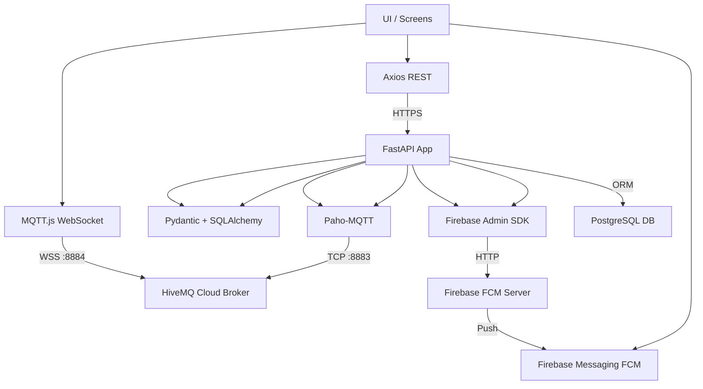

# 📄 Documentação do Projeto: **Futside**


## 1. 🎯 Visão Geral do Projeto

**Futside** é uma plataforma full-stack projetada para conectar jogadores de futebol amador, permitindo a criação, descoberta e participação em partidas de forma colaborativa e em tempo real.

O diferencial do Futside é sua arquitetura orientada a **eventos ao vivo**, combinando:

* API REST com **FastAPI**
* **MQTT** para tempo real
* **Firebase Cloud Messaging (FCM)** para notificações push

---

## 2. 🏗 Arquitetura do Sistema



---

## 3. ⚙️ Stack Tecnológico

### 🔙 Backend (FastAPI + Python)

* **FastAPI**: Framework web assíncrono e performático.
* **Uvicorn**: Servidor ASGI.
* **SQLAlchemy**: ORM para PostgreSQL.
* **Pydantic**: Validação e tipagem de dados.
* **Paho-MQTT**: Cliente MQTT para Python.
* **Firebase Admin SDK**: Envio de notificações FCM.
* **JWT com python-jose & Passlib**: Autenticação segura.

### 📱 Frontend (React Native + TypeScript)

* **React Native**: Interface multiplataforma nativa.
* **TypeScript**: Tipagem segura no frontend.
* **Axios**: Requisições REST.
* **MQTT.js**: Cliente MQTT sobre WebSocket.
* **Firebase Messaging**: Notificações Push.

### ☁️ Infraestrutura

* **Render.com**: Backend + PostgreSQL.
* **HiveMQ Cloud**: Broker MQTT.
* **Firebase Cloud Messaging (FCM)**: Push notifications.

---

## 4. 🚀 Hospedagem & Deploy

### Backend (FastAPI)

* Hospedado no **Render.com** como Web Service.
* Deploy contínuo via GitHub.
* Variáveis sensíveis (chaves, URLs) como variáveis de ambiente.
* Início do serviço: `uvicorn main:app --host 0.0.0.0 --port $PORT`

### Banco de Dados

* PostgreSQL no Render, acessado via `DATABASE_URL`.

### Broker MQTT

* **HiveMQ Cloud**

  * Porta TCP segura: `8883` (backend)
  * Porta WebSocket segura: `8884` (mobile)

### Notificações (FCM)

* Firebase Cloud Messaging.
* Envio por backend (Admin SDK).
* Recebimento pelos apps via Firebase Client SDK.

---

## 5. 🔄 Comunicação em Tempo Real (MQTT)

### 🧠 Conceito: MQTT

**MQTT** (Message Queuing Telemetry Transport) é um protocolo leve de mensagens pub/sub. Ideal para apps móveis, por consumir pouca banda e energia.

* **Broker** (HiveMQ): Centraliza e distribui mensagens.
* **Publisher**: Apenas o backend envia mensagens.
* **Subscriber**: Os apps assinam tópicos relevantes.

### 🧭 Fluxo Exemplo (Entrando no Lobby)

1. **Ação no App**: Usuário entra na "Partida 123"

2. **POST REST**: `/matches/123/join`

3. **Backend**:

   * Valida e registra no banco
   * Publica via MQTT:

   ```json
   {
     "event": "player_joined",
     "data": {
       "user_id": 4,
       "user_name": "Jogador A",
       "player_count": 5
     }
   }
   ```

4. **Broker HiveMQ** entrega para apps subscritos

5. **Apps atualizam a tela em tempo real**

---

### 📡 Tópicos MQTT Usados

| Tópico                                 | Evento                 | Publicador | Subscritor              |
| -------------------------------------- | ---------------------- | ---------- | ----------------------- |
| `futside/match/{matchId}/updates`      | Lobby (entrada/início) | Backend    | App (tela de lobby)     |
| `futside/match/{matchId}/live_updates` | Placar em tempo real   | Backend    | App (tela de jogo)      |
| `futside/matches/{city}`               | Nova partida na cidade | Backend    | App (exploração futura) |

---

## 6. 🔔 Push Notifications com Firebase (FCM)

### Por que FCM?

MQTT é ótimo para conexões ativas, mas não funciona quando o app está fechado. Para isso, usamos **Firebase Cloud Messaging**:

* Backend envia via **Firebase Admin SDK**
* Usuário recebe mesmo com app em segundo plano

### Exemplos de Uso:

* Alerta de nova partida criada
* Confirmação de entrada em jogo
* Cancelamento ou alteração de horário

---

## 7. 🌐 Fundamentos da Comunicação

### Camadas envolvidas:

| Tecnologia          | Função                                  |
| ------------------- | --------------------------------------- |
| **TCP**             | Protocolo base confiável (porta 8883)   |
| **WebSocket (WSS)** | Conexão persistente segura (porta 8884) |
| **MQTT**            | Protocolo de mensagens sobre TCP ou WSS |

---

## 8. 📋 Funcionalidades do App

* ✅ Cadastro/Login com JWT
* 📍 Gerenciamento de Locações (quadras)
* ⚽ Criação/Descoberta de Partidas
* 👥 Lobby de Jogadores em Tempo Real
* 📊 Partidas ao Vivo com Placar Atualizado
* 🔔 Notificações Push (FCM)
